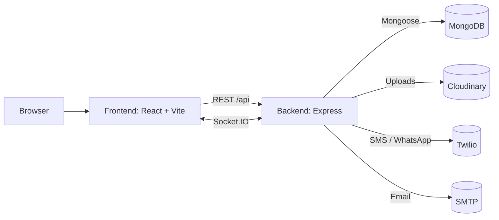

# Student Academic Reminder & Resource Platform

A full-stack MERN application that helps students, class representatives (CR), and admins manage semester subjects, internal components (assignments, tests, presentations), study materials, events, and real-time class chat. The frontend is a Vite + React + Tailwind app, and the backend is an Express + MongoDB API with JWT auth, Cloudinary file uploads, and Socket.IO chat.

## Contents
- Project overview
- Why this project was made
- What it does (features)
- Tech stack
- Architecture
- Data model
- API overview
- Frontend routes
- File uploads
- Notifications and reminders
- Environment variables
- Local development
- Scripts
- Folder structure
- Current limitations and notes

## Project overview
This project centralizes academic planning and resources into a single platform:
- Manage subjects and semester structure.
- Track internal components with deadlines and attachments.
- Share study materials with comments.
- Coordinate events and competitions.
- Keep a class-wide chat in sync using real-time updates.

## Why this project was made
- Reduce scattered communication across multiple apps.
- Provide a single source of truth for deadlines, study materials, and event updates.
- Enable CR and admin roles to publish structured academic information for an entire semester.
- Give students a fast, modern interface with real-time feedback.

## What it does (features)
- Authentication and roles: JWT-based auth with roles `student`, `cr`, and `admin`.
- Semester and subject management: create and list semesters/subjects (CR/Admin only for creation).
- Internal components (reminders): create, update, and delete internal components with deadlines and attachments.
- Study materials: upload materials (Cloudinary) and browse by subject.
- Comments: add, pin, and delete comments on materials.
- Events: create and list events with optional registration links.
- Chat: real-time class chat with read receipts and basic emoji tooling.
- Dashboard: aggregate counts and quick links to materials, reminders, events, and chat.
- PWA manifest: includes a web manifest for installability (icons currently empty).

## Tech stack
**Frontend**
- React 18
- Vite
- Tailwind CSS
- React Router
- Axios
- Socket.IO client

**Backend**
- Node.js + Express
- MongoDB + Mongoose
- JWT authentication
- Socket.IO
- Cloudinary (uploads)
- Multer (upload middleware)
- Swagger (OpenAPI docs)
- Nodemailer (email notifications)
- Twilio (SMS/WhatsApp notifications)
- Node-cron (scheduled jobs placeholder)

## Architecture
High-level flow:
- React client authenticates via JWT and calls REST endpoints on the Express API.
- Express routes delegate to controllers that interact with Mongoose models.
- Socket.IO provides real-time chat updates and read receipts.
- Uploads are stored in Cloudinary (direct from client or via backend upload endpoint).
- Notification utilities can send SMS, WhatsApp, and email when internal components are created.



## Data model
**User**
- name, email, password (hashed)
- role: `student`, `cr`, `admin`
- semester (ref to Semester)
- phoneNumber, whatsappNumber

**Semester**
- number (1-8), name (roman numerals)

**Subject**
- name, code
- semester (ref to Semester)

**InternalComponent**
- subject (ref to Subject)
- type: assignment1, assignment2, classTest1, classTest2, presentation, research
- deadline, description
- createdBy (ref to User)
- attachments array (name, url, secureUrl, signedUrl, format, mimeType, size, publicId, resourceType, version, uploadedBy, uploadedAt)
- attachmentNote

**Material**
- title, description
- subject (ref to Subject)
- url, secureUrl, publicId, resourceType, format, version, size, originalFilename
- storageProvider: `cloudinary` or `firebase` (cloudinary is used in current flows)
- uploadedBy (ref to User)
- commentCount

**Comment**
- material (ref to Material)
- author (ref to User)
- content, parentComment, mentions
- isPinned, isDeleted

**Event**
- name, date, description
- registrationLink, tags
- createdBy (ref to User)

**ChatMessage**
- sender (ref to User)
- content, replyTo
- attachments (url, type, name)
- readBy (list of Users)
- isPinned, isDeleted

**Notification**
- recipient (ref to User)
- channel: whatsapp, sms, email, inapp
- type: reminder, event, material, chat, system
- payload (object), status, scheduledFor

## API overview
Base path: `/api`

**Health and docs**
- `GET /health` - health check
- `GET /api/docs` - Swagger UI

**Auth**
- `POST /api/auth/register`
- `POST /api/auth/login`
- `GET /api/auth/me`

**Semesters**
- `GET /api/semesters`
- `POST /api/semesters` (CR/Admin)

**Subjects**
- `GET /api/subjects`
- `POST /api/subjects` (CR/Admin)
- `DELETE /api/subjects/:id` (CR/Admin)

**Internal components (reminders)**
- `GET /api/components`
- `GET /api/components/upcoming`
- `POST /api/components` (CR/Admin)
- `PUT /api/components/:id` (CR/Admin)
- `DELETE /api/components/:id` (CR/Admin)

**Materials**
- `GET /api/materials`
- `GET /api/materials/:id`
- `POST /api/materials` (CR/Admin)

**Material comments**
- `GET /api/materials/:materialId/comments`
- `POST /api/materials/:materialId/comments`
- `POST /api/materials/:materialId/comments/pin/:id` (CR/Admin)
- `DELETE /api/materials/:materialId/comments/:id` (CR/Admin)

**Events**
- `GET /api/events`
- `POST /api/events` (CR/Admin)
- `DELETE /api/events/:id` (CR/Admin)

**Chat**
- `GET /api/chat`
- `POST /api/chat`
- `POST /api/chat/read`

**Notifications**
- `GET /api/notifications`

**Uploads**
- `POST /api/uploads` (CR/Admin, multipart form `file`)

## Frontend routes
- `/` - public landing page
- `/login` - login
- `/register` - registration
- `/dashboard` - protected dashboard
- `/subjects` - protected subjects page
- `/materials` - protected materials list
- `/materials/:id` - protected material detail with comments
- `/events` - protected events list
- `/chat` - protected real-time chat
- `/reminders` - protected internal components dashboard

Notes:
- `ProtectedRoute` redirects to `/login` if not authenticated.
- `RoleGuard` exists but is not wired to routes in `App.jsx`.
- Admin page components exist under `frontend/src/pages` but are not registered in the router.

## File uploads
There are two upload paths used by the UI:
1. Direct Cloudinary uploads from the browser via `uploadToCloudinary`.
2. Fallback to the backend `/api/uploads` route if the direct upload fails.

Backend uploads use in-memory Multer storage and then stream files to Cloudinary. Large files use Cloudinary's `upload_large_stream` when above the configured threshold.

## Notifications and reminders
- Creating an internal component triggers notifications to students in the same semester (SMS, WhatsApp, and email) when Twilio/SMTP credentials are configured.
- A cron job is scheduled to run hourly but currently has no reminder dispatch logic implemented.
- The Notification model and `/api/notifications` endpoint exist, but the app does not currently create notification records in code.

## Environment variables
No `.env.example` file exists in this repository. The variables below are read directly in code.

### Backend (.env)
Required for core functionality:
- `MONGO_URI` - MongoDB connection string
- `JWT_SECRET` - JWT signing secret

Required for uploads:
- `UPLOAD_MAX_MB` - max upload size in MB (used by `/api/uploads`)
- `CLOUDINARY_CLOUD_NAME`
- `CLOUDINARY_API_KEY`
- `CLOUDINARY_API_SECRET`
- `CLOUDINARY_UPLOAD_FOLDER`
- `CLOUDINARY_UPLOAD_RESOURCE_TYPE`

Optional / environment settings:
- `PORT` (default 5000)
- `FRONTEND_ORIGIN` (default http://localhost:5173, comma-separated for multiple)
- `NODE_ENV`
- `MONGO_MAX_POOL_SIZE`
- `MONGO_MIN_POOL_SIZE`
- `CLOUDINARY_LARGE_UPLOAD_THRESHOLD_MB` (defaults to 95 MB)

Optional notifications:
- `SMTP_HOST`, `SMTP_PORT`, `SMTP_USER`, `SMTP_PASSWORD`
- `TWILIO_ACCOUNT_SID`, `TWILIO_AUTH_TOKEN`, `TWILIO_PHONE_NUMBER`
- `WHATSAPP_SANDBOX_NUMBER`

### Frontend (.env)
Required:
- `VITE_API_BASE` - backend API base URL (for example `http://localhost:5000/api`)
- `VITE_MAX_UPLOAD_MB` - used for client-side upload size checks

Cloudinary direct upload:
- `VITE_CLOUDINARY_CLOUD_NAME`
- `VITE_CLOUDINARY_UPLOAD_PRESET`
- `VITE_CLOUDINARY_API_BASE`
- `VITE_CLOUDINARY_UPLOAD_FOLDER`
- `VITE_CLOUDINARY_UPLOAD_RESOURCE_TYPE`

Optional helpers for previews:
- `VITE_CLOUDINARY_DELIVERY_BASE` - used to build fallback delivery URLs
- `VITE_DOC_PREVIEW_BASE` - used to preview Office files via a viewer URL

## Local development
### Prerequisites
- Node.js 18+
- MongoDB (local or Atlas)
- Cloudinary account (for uploads)

### Backend
```bash
cd backend
npm install
npm run dev
```

### Frontend
```bash
cd frontend
npm install
npm run dev
```

## Scripts
**Backend**
- `npm run dev` - start backend with nodemon
- `npm start` - start backend
- `npm run lint` - lint backend

**Frontend**
- `npm run dev` - start Vite dev server
- `npm run build` - build frontend
- `npm run preview` - preview production build
- `npm run lint` - lint frontend

## Folder structure
```text
.
├─ backend/
│  ├─ config/
│  │  ├─ cloudinary.js
│  │  ├─ db.js
│  │  └─ swagger.js
│  ├─ controllers/
│  ├─ middlewares/
│  │  ├─ auth.js
│  │  └─ errorHandler.js
│  ├─ models/
│  ├─ routes/
│  ├─ sockets/
│  │  └─ index.js
│  ├─ utils/
│  │  ├─ jwt.js
│  │  └─ notify.js
│  └─ index.js
├─ frontend/
│  ├─ public/
│  │  └─ manifest.webmanifest
│  ├─ src/
│  │  ├─ components/
│  │  │  ├─ ProtectedRoute.jsx
│  │  │  └─ RoleGuard.jsx
│  │  ├─ context/
│  │  │  └─ AuthContext.jsx
│  │  ├─ hooks/
│  │  │  └─ useAuth.js
│  │  ├─ layouts/
│  │  │  └─ DashboardLayout.jsx
│  │  ├─ pages/
│  │  │  ├─ LandingPage.jsx
│  │  │  ├─ DashboardPage.jsx
│  │  │  ├─ SubjectsPage.jsx
│  │  │  ├─ MaterialsPage.jsx
│  │  │  ├─ MaterialDetailPage.jsx
│  │  │  ├─ EventsPage.jsx
│  │  │  ├─ ReminderDashboard.jsx
│  │  │  ├─ ChatPage.jsx
│  │  │  ├─ LoginPage.jsx
│  │  │  ├─ RegisterPage.jsx
│  │  │  ├─ AdminSubjectsPage.jsx
│  │  │  ├─ AdminMaterialsPage.jsx
│  │  │  ├─ AdminComponentsPage.jsx
│  │  │  └─ AdminEventsPage.jsx
│  │  ├─ services/
│  │  │  ├─ api.js
│  │  │  └─ upload.js
│  │  ├─ App.jsx
│  │  ├─ index.css
│  │  └─ main.jsx
│  ├─ index.html
│  ├─ tailwind.config.js
│  └─ vite.config.js
├─ .github/
│  ├─ prompts/
│  └─ skills/
├─ instructions.txt
├─ notes.txt
├─ middlewares/  (empty)
└─ utils/        (empty)
```

## Current limitations and notes
- The cron job is a placeholder; reminder dispatch is not implemented yet.
- The Notification collection is read via `/api/notifications`, but no code currently creates notification records.
- PWA manifest is present but `icons` is empty.
- Admin pages exist in the frontend but are not wired to routes.
